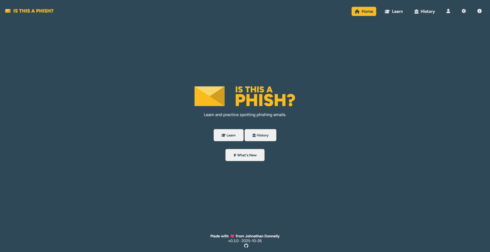

# Is This a Phish?

**An interactive educational website for learning to spot phishing emails.**

🕹 [Check it out here](https://johnathandonnelly.github.io/Is-This-a-Phish/)

## 🧠 What It Does

You are presented example emails and must choose: **Phish** or **Legit**.

## 📸 Screenshots



## 🚀 Getting Started

1. Clone the repository

```bash
git clone https://github.com/johnathandonnelly/Is-This-a-Phish.git
```

2. Navigate to the project folder

```bash
cd Is-This-a-Phish
```

3. Start a local server

```bash
python -m http.server 3000
```

4. Open your browser and go to

```bash
http://localhost:3000
```

Or simply use the [live demo](https://johnathandonnelly.github.io/Is-This-a-Phish/)

## 💡 Why I Built This

I wanted to create a practical, accessible tool to help people build confidence in identifying phishing emails, and apply my own cybersecurity knowledge in the process.

## 📜 License

### Apache License 2.0 (for version 0.0.5+)

© 2025 Johnathan Donnelly

Licensed under the Apache License, Version 2.0.

### MIT License (for version 0.0.1-4)

© 2025 Johnathan Donnelly

Licensed under the MIT License.