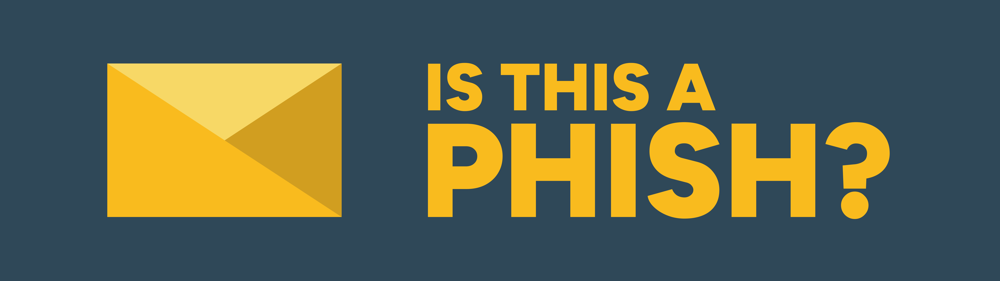

<p align="center">
    
</p>

<h1 align="center">
    <span>Is This a Phish?™</span>
</h1>

<p align="center">
    <a href="https://skillicons.dev"></a>
</p>

<h3 align="center">
    <a href="#-installation">Installation</a>
    <span> · </span>
    <a href="#-whats-new">What's New</a>
</h3>

<br/><br/>
Learn to spot phishing emails through interactive lessons.
<br/><br/>
Check it out [here](https://johnathandonnelly.github.io/Is-This-a-Phish/)
<br/><br/>

## 🖼️ Preview


## 🔍 Features

* Interactive phishing email identification
* Instant feedback and explanations
* No sign-up or login

## 📋 Installation

Choose one of the installation methods below:

<details>
<summary>GitHub Pages</summary>

Open the website hosted here on GitHub Pages:

[Is This a Phish?™](https://johnathandonnelly.github.io/Is-This-a-Phish/)
</details>

<details>
<summary>Local Server (Python Required)</summary>

Clone the repository and run a local server to open in a web browser:

*Clone the repository*
```powershell
git clone https://github.com/johnathandonnelly/Is-This-a-Phish.git
```

*Navigate to the project folder*
```powershell
cd Is-This-a-Phish
```

*Start a local server*
```powershell
python -m http.server 3000
```

*Open your browser and open the website*
```powershell
http://localhost:3000
```
</details>

## ✨ What's New

**Version 0.3.0**

For detailed changes, visit [Releases](https://github.com/johnathandonnelly/Is-This-a-Phish/releases).

**✨ Highlights**

* Quickly view what's new from Home
* Track your Total Completed count from Profile

**Changes**

* Credits is its own page
* Cleaner navigation

## 🛣️ Roadmap

For future updates, I'll focus on the items below:

* Improved UI and accessibility
* Improved and narrative-driven lessons
* Support for different screen sizes
* Support for other languages
* Support for local installation
* Functionality for attachments and links
* New random challenge mode
* New custom colour themes
* New separate real life scenarios

## 🙋 FAQ

**Q: Is it safe to click on the phishing emails in the site?**<br>
A: Yes! All the emails are fake and for educational use only.

**Q: Does the site collect any user data?**<br>
A: No. All progress is stored in your LocalStorage, which can be cleared and exported through the Settings page.

## 🤝 Contributing

Contributions, suggestions, and feedback are all welcome!

Before you start, please read the [Contributing Guide](/CONTRIBUTING.md).

## 🏷️ Trademark

Is This a Phish?™ and its logos are trademarks of Johnathan Donnelly.

They may not be used without written permission.

## 📜 License

Copyright © Johnathan Donnelly.

> All code in this repository is licensed under the Mozilla Public License 2.0 (MPL-2.0). See [LICENSE-CODE](/LICENSE-CODE) for full license text.

> All creative content (images, text, other assets) in this repository is licensed under the Creative Commons Attribution-NonCommercial-ShareAlike 4.0 International License (CC BY-NC-SA 4.0). See [LICENSE](/LICENSE) for full license text.

## ℹ️ Credits

See [Credits](/app/credits.html) for contributors, external assets, and credits.